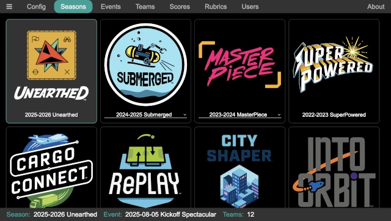

..
   Copyright (c) 2025 Brian Kircher

   Open Source Software; you can modify and/or share it under the terms of BSD
   license file in the root directory of this project.

Admin
=====

The administration panel is used to perform high-level configuration and event
management for FLL Scorer. The high-level configuration applies to all events,
while the event/team management, along with the score/rubric management, is
used to setup an individual event and track/adjust its operation.

This is typically used by a key volunteer, such as the Tournament Director,
Head Referee, Judge Advisor, and so on, or their designee.

The adminstration panel consists of the following panels:

:doc:`config/config`
    Configuration of the scoring system.

:doc:`seasons/seasons`
    Selection of the season.

:doc:`events/events`
    Management of the event.

:doc:`teams/teams`
    Management of the teams.

:doc:`scores/scores`
    Management of the scores.

:doc:`rubrics/rubrics`
    Management of the rubrics.

:doc:`users/users`
    Management of the users.

.. toctree::
   :maxdepth: 2
   :caption: Admin
   :hidden:

   config/config
   seasons/seasons
   events/events
   teams/teams
   scores/scores
   rubrics/rubrics
   users/users