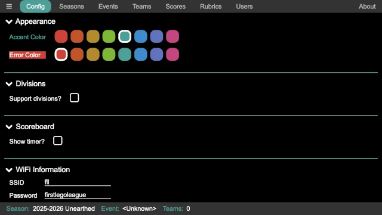

..
   Copyright (c) 2025 Brian Kircher

   Open Source Software; you can modify and/or share it under the terms of BSD
   license file in the root directory of this project.

Config
======

The configuration panel provides some high-level controls for the application.
These are typically setup one time and then left alone, though it is possible
to change them whenever.

Clicking on the carot before the various headings expand and hide the detailed
configuration of that section, making it easier to navigate through the various
items.

Appearance
----------

The appearance section allows the accent and error colors to be selected.

.. image:: appearance.webp
   :alt: Selections for accent and error color
   :align: center

The accent color is used for highlighting certain portions of the pages;
outlines, selected items, and so on.  Each season, this can be changed based on
"matching" or complementing the season's logo, or it can be stay the same from
season to season.

The error color is used to highlight errors in the robot game scoresheet.  In
addition to being a different color, it is inverted (the error color is the
background, and the text is white).  It is best if the error color complements
the accent color, so that errors stand out.  Generally, picking a color that is
four colors away from the accent color is a good complement (and looks good as
well).

Divisions
---------

Some regions use divisions to separate teams such that 4th graders do not
compete against 8th graders.  By default, division support is not enabled (so
there are no divisions).

Clicking on the ``Support divisions?`` check box clicked, division support is
enabled the remaining division configuration fields are displayed.  If division
support is enabled, it is still possible to have an event with teams from only
one division in attendance; all the audience displays still show as being that
division.

``Number of divisions`` allows a selection of two to four divisions for the
events.  Based on the selection, there are two to four division configurations
shown.

``Name 1`` though ``Name N`` allows the name of the division to be entered (if
something other than the default of "Division 1", "Division 2", and so on) is
used.  Additionally, each division has a color selection, which shows up on the
scoreboard as the background color for the headings (instead of the accent
color); this helps to quickly visualize which division is being shown on the
scoreboard.

Scoreboard
----------

The scoreboard can optionally have the timer displayed on it as well, making it
possible to run an event with only a single audience display (if resources are
limited).

The ``Show timer?`` checkbox enables the timer on the scoreboard when clicked.
When enabled, the further configuration is shown.

``Location`` allows the placing the timer at the top of the scoreboard (over
the location name, between the logos) or in the center of the scoreboard (over
the scores).

WiFi Information
----------------

This allows for entry of the WiFi credentials for the WiFi network in use at
the event.  This does not affect the scoring computer (or any other device)
connecting to the WiFi network, it simply gets encoded into the WiFi
:doc:`../../qr_codes/qr_codes` so that other devices (typically mobile devices)
can more easily connect to the network (since they do not have to type the
credentials).

.. image:: wifi.webp
   :alt: WiFi credentials entry
   :align: center

The ``SSID`` is the name of the WiFi network.

The ``Password`` is the password required to gain access to the WiFi network.

Whenever these values have been changed, the :doc:`../../qr_codes/qr_codes`
page must be refreshed in order to re-generate the WiFi QR code.