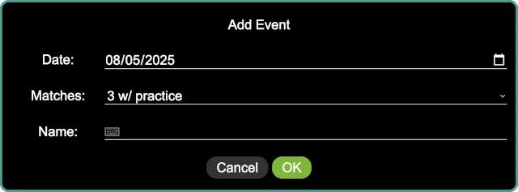

..
   Copyright (c) 2025 Brian Kircher

   Open Source Software; you can modify and/or share it under the terms of BSD
   license file in the root directory of this project.

Events
======

The events panel allows events to be added, selected, edited, and deleted.  The
events that have been entered for this season are listed on this panel:

.. image:: events.webp
   :alt: Events panel
   :align: center

Adding an Event
---------------

Click on the :fa:`plus` button in the lower right of the screen, or press
*Ctrl-A*, to bring up the add event panel:

``Date`` is the date of the event.  It can be entered by typing, or the
calendar icon at the right of the input box brings up a calendar control for
selecting the event date.

``Matches`` is the number of matches at the event.  The choices are:

- **2** - For an event with two official rounds.

- **3** - For an event with three official rounds.

- **3 w/ practice** - For an event with a practice round followed by three
  official rounds.

- **4** - For an event with four official rounds.

``Name`` is the name of the event; this appears at the top of the scoreboard.

Seleting an Event
-----------------

When viewing the list of events, there is a ``Select`` column with a set of
check boxes; the one with a check is the current event.  This is also reflected
in the status bar at the bottom next to ``Event:``.  Clicking one of the check
boxes changes the current event to the one that is clicked.  All information
(scores and so on) about an event is saved even when the event is not selected;
it can be accessed by re-selecting the event.

.. danger::
   Changing the selected event in the middle of the event wreaks havoc on the
   scoring system, and starts storing new data into the wrong event (the one
   that is newly selected!).  Do not change events in the scoring system during
   an event!

Searching for an Event
----------------------

The search at the bottom of the panel provides a way to search for an event (in
case there are a large number of events).  Either click on the search box, or
press *Ctrl-S* to go to the search box, and start typing.  The list of events
is dynamically updated for every key press.

Pressing *Escape* while the search box has the keyboard focus clears the search
box, showing the entire list of events.

Editing an Event
----------------

Clicking on the :fa:`pencil` button in the ``Actions`` column opens the edit
event dialog for the event in question (which may be the currently selected
event, or another event).  The dialog looks the same as the add event dialog,
and has the same set of fields.

It is safe to edit a the current event in the middle of that event.

Deleting an Event
-----------------

Clicking on the :fa:`trash` button in the ``Actions`` column deletes an event
(along with all the scores and rubrics from that event).  A confirmation dialog
confirms the action to delete the event; if confirmed, the event and any
associated data is deleted.

.. danger::
   There is no undo for this operation!