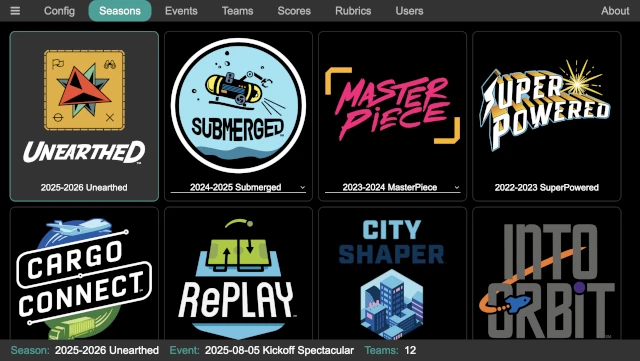

..
   Copyright (c) 2025 Brian Kircher

   Open Source Software; you can modify and/or share it under the terms of BSD
   license file in the root directory of this project.

Seasons
=======

The seasons panel allows the game that is used at the event to be selected.
The vast majority of the time, it will be the most recent game; older games are
available for possible use in an off-season fun competition (where an old game
is revisited, preferably one old enough that none of the current participants
actually worked on that game in the past!).

Clicking on one of the seasons selects it, as indicated by the gray background
and the accent color outline (as well as it being listed in the status line at
the bottom as the season).  Everything else about the system (events, teams,
scores, and so on) are unique to the season; changing the seasons hides the
details of the previously selected season, but they are still available by
simply selecting the previous season again.

Every season of FLL is listed, though not all of them have scoresheets
available in the system.  If the logo is grayed out (and therefore
unclickable), there is not a scoresheet available and it can not be scored.
Some seasons have alternate games available, such as the World Festival Encore
challenge.  While they can be selected and the scoresheet used, the challenge
rules must be obtained via other methods (or good guesses made based on the
scoresheet!).

The following seasons are supported:

* 2025-2026 Unearthed
* 2024-2025 Submerged

  * Official game
  * World Festival Encore game

* 2023-2024 Master Piece

  * Offical game
  * World Festival Encore game

* 2022-2023 Super Powered
* 2021-2022 Cargo connection
* 2020-2021 RePlay
* 2019-2020 City Shaper
* 2018-2019 Into Orbit
* 2017-2018 Hydro Dynamics
* 2016-2017 Animal Allies
* 2015-2016 Trash Trek
* 2014-2015 World Class