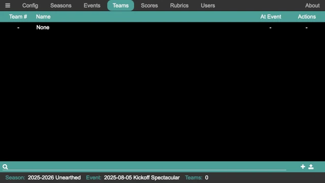
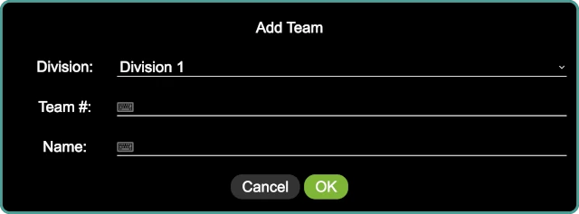

..
   Copyright (c) 2025 Brian Kircher

   Open Source Software; you can modify and/or share it under the terms of BSD
   license file in the root directory of this project.

Teams
=====

The teams panel provides a means of managing the teams.  Teams can be added,
edited, deleted, and added to the current event.

Adding a Team
-------------

A team can be added to the system by clicking on the :fa:`plus` button in the
lower right of the panel, or by pressing *Ctrl-A*.  The add team dialog is
displayed:

The team details include:

Division
   The team's division.  This detail only exists when division support is
   enabled; otherwise, it is not present here.

Team #
   The team's number, as assigned by FIRST.  If the event is a scrimmage with
   unregistered teams, unofficial teams, new teams, and so on, make up a number
   for the team.

Name
   The team's name, as dreamed up by the team!  Some of them are more fun than
   others, but they are all meaningful to the team.

Bulk Adding Teams
-----------------

Many times, there is a list of teams in a spreadsheet of some kind that is used
to track who is attending an event, who has competed any number of pre-event
requirements, and so on.  By exporting that spreadsheet (or a subset of it) to
a CSV, the teams can be bulk-imported into the system.

The CSV must contain two (or three) columns:

number
   The team's number, usually as assigned by FIRST.

name
   The team's name.

division
   (Optional) The team's division.  This column does not need to appear if
   division support is not enabled.

The order of these columns it not important, and neither is the capitalization.
Other columns can be present as well; they will be ignored.  The following is
an example CSV file::

   number,name
   37350,"Bricks r' Us"
   43157,"Motors of Mayhem"
   47654,"LEGO Legion"
   52528,"Friends of LEGO"
   53342,"We V3"
   55578,"Crazy Gyros"
   55699,"Block Stars"
   57773,"Blockenspiel"
   57873,"Beams & Axles"
   58405,"Snapped Together"
   63979,"Spike Storms"
   64057,"Gearheads"

Once the CSV file is ready, click on the :fa:`upload` button in the lower right
of the panel to open a file dialog; select the CSV file to import it.  If there
are no errors, the teams are imported into the system *and* added to the
current event.

If a team is in the CSV file but already exists in the system (as determined by
the team number), it is instead edited (changing the team name and/or division,
if required).  In this way, if the teams have already been setup for the event
and then there is a late addition, the main spreadsheet can be updated, a new
CSV created, and the CSV re-imported into the system.

Adding a Team to the Event
--------------------------

When viewing the list of teams, there is an ``At Event`` column with a set of
check boxes; if the check box next to a team is checked, that team is "at" the
event (and shows up on the referee's scoring, the scorboard, and so on).
Unchecking the check box next to a team removes that team from the event; when
a team is removed from an event, all of the team's score are removed as well.

.. danger::
   Since removing a team from an event also deletes all their scores at that
   event, removing a team from the current event is a very dangerous thing to
   do.

   This is no undo for the deletion of all the team's scores!

Searching for a Team
--------------------

The search at the bottom of the panel provides a way to search for a team (in
case there are a large number of teams, which is typically the case).  Either
click on the search box, or press *Ctrl-S* to go to the search box, and start
typing.  The list of teams is dynamically updated for every key press.

Pressing *Escape* while the search box has the keyboard focus clears the search
box, showing the entire list of teams.

Editing a Team
--------------

Clicking on the :fa:`pencil` button in the ``Actions`` column opens the edit
team dialog for the team in question.  The dialog looks the same as the add
team dialog, and has the same set of fields.

It is safe to edit a team in the middle of that event.

Deleting a Team
---------------

Clicking on the :fa:`trash` button in the ``Actions`` column deletes a team
(along with all the scores and rubrics for that team; from any events that team
is a part of).  A confirmation dialog confirms the action to delete the team;
if confirmed, the team and any associated data is deleted.

.. danger::
   There is no undo for this operation!