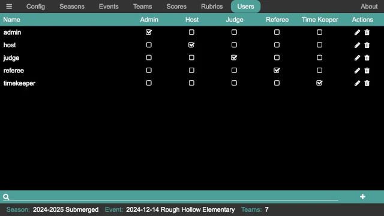

..
   Copyright (c) 2025 Brian Kircher

   Open Source Software; you can modify and/or share it under the terms of BSD
   license file in the root directory of this project.

Users
=====

User management is accomplished using the user pane.  Users can be added,
deleted, renamed, have their password changed, and have their permissions
updated.

Overview
--------

The user panel shows the set of users in the system, the permissions that they
each have, and provides a means to add, edit, and delete users.

Beside each user is a set of check boxes for adding (when checked) or removing
(when empty) the corresponding permission.  The edit user :fa:`pencil` button
allows the user name and/or password to be changed, and the delete user
:fa:`trash` button provides a way to delete a user.

Clicking the add user :fa:`plus` button in the lower right, or pressing
*Ctrl-A* on the keyboard, brings up the Add User dialog:

.. image:: add_user.webp
   :alt: Add/Edit User dialog
   :align: center

When editing a user, the dialog is almost identical (except it says ``Edit
User``, and the Name is pre-populated with the current user name).

Permissions
-----------

There are five permissions in the FLL Scoring system:

Admin
    This permission has no restrictions; is allows any action to be performed.

Host
    This permission is only slightly less restricted than the ``Admin``
    permission, and it intended for an event host, tournament director, and so
    on.

Judge
    Allows access to the :doc:`/judge/judge` page, allowing entry,
    modification, and viewing of rubrics.

Referee
    Allows access to the :doc:`/referee/referee` page, allowing entry,
    modification, and viewing of robot game scoresheets and scores.

Timekeeper
    Allows access to the :doc:`/timekeeper/timekeeper` page, allowing the match
    timer to be started, stopped, and reset.

Each user can have as many of these permissions as required to allow the
volunteers to perform the role that is asked of them.

Login Types
-----------

There two ways to setup users in the system; either role-based logins or
user-based logins.  Or, a combination of the two can be used, with some
volunteers using role-based logins with others using user-based logins.

Admin Login
~~~~~~~~~~~

The ``admin`` user is a special user.  This user can not be renamed or deleted,
and its permissions can not be changed; it is a permanent user.  The password
can be changed, however; the default password is ``FLLRocks!``.  When run for
the first time, the ``admin`` user is created with the default password;
clicking the ``Reset Admin Password`` on the main application window resets the
``admin`` user to the default password (in case it is changed to something that
no-one remembers!).

Changing the ``admin`` user password at the start of an event is recommended to
ensure that only authorized volunteers have access (in case someone who
volunteered at the previous event is a coach at the current event).  This
allows the volunteers to say in good conscience that the coach in question did
not have access to the system, should the unfortunate situation arises that
someone makes accusations of impropriety.  Of course, whether this precaution
is needed is entirely up to the judgement of the event organizers.

.. _role_based_logins:

Role-based Logins
~~~~~~~~~~~~~~~~~

When using role-based logins, volunteers with the same role all login using the
same credentials. The suggested logins are as follows (with each login having
the permission that matches the login name):

host
    Used by the tournament director, and by the scorekeeper when the tournament
    is run with paper scoresheets that are entered by a scorekeeper (or two!).

judge
    Used by the JA and the judges (if capturing the judging rubrics).  More
    typically, the capture of rubrics would happen at the conclusion of the
    event, and the JA/judges would not use this during the event.

referee
    Used by the head referee and the table referees.  The table referees use
    this to be able to fill in the scoresheets with the team at the end of
    each match, and the head referee uses this to track the scoresheets/scores
    as the event progresses (to make sure scoresheets/scores are entered in
    the correct round, a team isn't missed, and so on).

timekeeper
    Used by the time keeper to start the official match timer (if using the
    one provided by FLL Scorer) at the start of each match.

When these logins are created, their password is set as well.  Like the
``admin`` password, these should probably be changed from event to event.

User-based Logins
~~~~~~~~~~~~~~~~~

When using user-based logins, each person has their own login, and are
individually granted the permissions they need to perform their volunteer role.
For example, some volunteers may be trading time as table referees (and
therefore need the ``Referee`` permission), but double as the time keeper when
not being a table referee (and therefore need the ``Timekeeper`` permission).
Other volunteers may be table referees only, and are only granted the
``Referee`` permission.

If there is a coach who was a volunteer at a previous event, it is probably
best to remove all their permissions for the duration of the event.

While providing more flexibility, user-based logins also require more logins to
be created (one per volunteer).  Many times, those can be created prior to the
event, but inevitably some will need to be created at the event (based on who
shows up to help!).