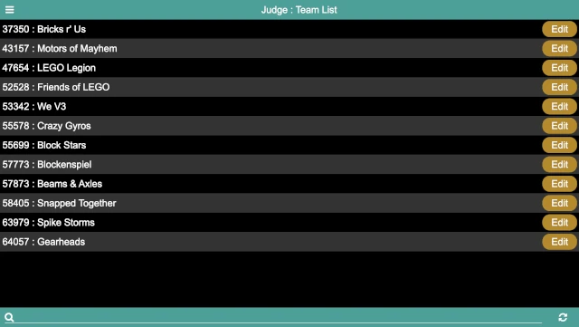
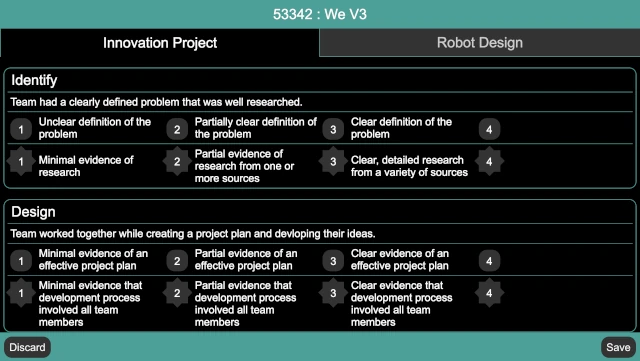

..
   Copyright (c) 2025 Brian Kircher

   Open Source Software; you can modify and/or share it under the terms of BSD
   license file in the root directory of this project.

Judge
=====

.. note::
   The Judge page is only used if utlizing the :doc:`../league/league`.

The judge page provides a means for the judges to enter rubrics at the
conclusion of judging, while at the same time providing a way for the judge
advisor to monitor the state of the rubrics entry.  At first, it displays a
list of the teams at the event:

The rubrics are color-coded:

Yellow
   This represents a rubric that has not been entered.  At the start of the
   event, all the rubrics are yellow (as in the above image).

Red
   This represents a rubric that has been partially entered.

Green
   This represents a rubric that has been fully entered.  At the end of the
   event, all rubrics should be green (unless there are no-shows, either to the
   entire event or to judging).

The list of teams can be scrolled through to find the team to be judged (they
are listed in team number order), or the search at the bottom of the screen can
be used to search (by either team name or team number).

The :fa:`refresh` button in the bottom right refreshes the list of rubrics; in
normal conditions, this is not necessary (as rubrics entred by other judges are
automatically reflected onto all the judge's displays); this can be used in
case something doesn't seem right, or to confirm that the latest and greatest
is being displayed.

Clicking on the ``Edit`` button next to a team brings up the team's rubric:

The rubrics match (if possible, otherwise closely approximates) the official
rubrics.  A choice must be made for every rubric condition before it is
considered to be complete.

.. note::
   Unlike the official rubrics, there is not a way to enter information about
   why a team was awarded an ``Exceeds / 4`` on one of the rubric areas, and
   does not have a way to fill out the "Judging Session Feedback" rubric page.
   Only the raw scores can be captured (since its purpose is to support the
   :doc:`../league/league`).

There are two buttons on the bottom of the rubric page:

Discard / :fa:`times`
   This closes the rubric, discarding changes (if any).  If there are changes,
   a confirmation dialog ensures that the changes should be discarded.  If
   there are no changes, the rubric is closed immediately.

Save / :fa:`save`
   This saves and then closes the rubric.  The rubric can be saved even if it
   is not fully filled out.

Once fully entered, the rubric should be saved.  Repeat for every team in your
judging room throughout the event.

.. note::
   Another approach to entering the rubrics is to scan the paper rubrics prior
   to returning them to the teams, and then enter them into the system after
   the event is over.  This approach does not allow the league standings to be
   displayed at the end of the awards ceremony, however.