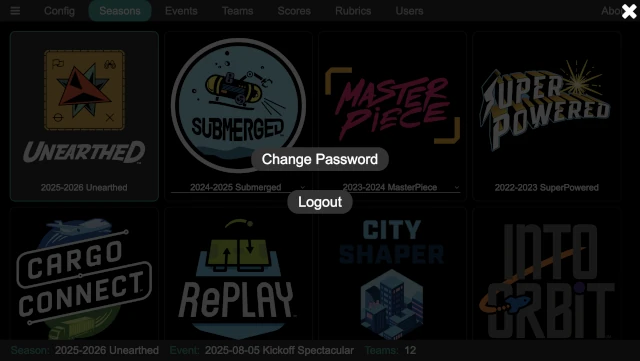

..
   Copyright (c) 2025 Brian Kircher

   Open Source Software; you can modify and/or share it under the terms of BSD
   license file in the root directory of this project.

Login/Logout
============

Some of the pages required an authenticated user, ensuring that only those who
should be in the system are able to get in (and therefore have access to the
event data).  If an attempt is made to access a protected page, and there is
not a user logged in, the login page appears:

.. image:: login.webp
   :alt: The login page
   :align: center

Enter the user name and password, then press the ``Login`` button to log into
the system.  If a user has forgotten their password, and admin can use the
:doc:`../admin/users/users` panel of the :doc:`../admin/admin` page to reset
their password.

When run for the first time, and admin user is created with a user name of
``admin`` and password of ``FLLRocks!``.  The ``Reset Admin Password`` button
on the main application to reset the ``admin`` user's password back to the
default (in case it was changed and then forgotten).

When logged in and in a protected page, there is a user menu in the upper left
corner, accessed by pressing the :fa:`bars` button:

From here, one of two things can be done:

Change Password
   The currently logged in user's password can be changed with this button.  It
   pops up a change password dialog:

   .. image:: ch_pass.webp
      :alt: The change password dialog
      :align: center

   Enter the current password and the new password (twice!), then click on
   ``Change`` to change the password.

Logout
   This logs the current user out of the system.  Attempts to return to a
   protected page results in the login panel being displayed again.