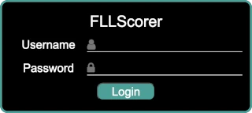
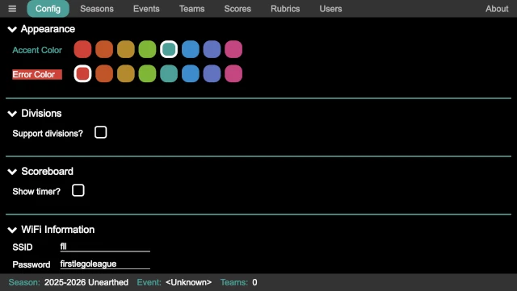
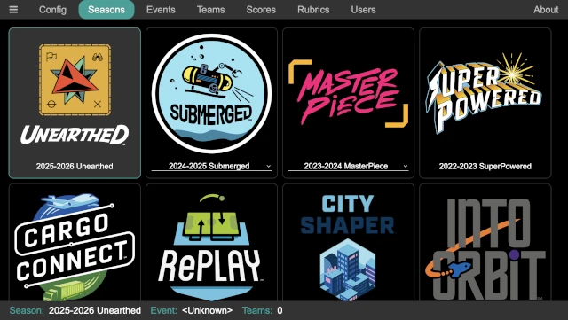
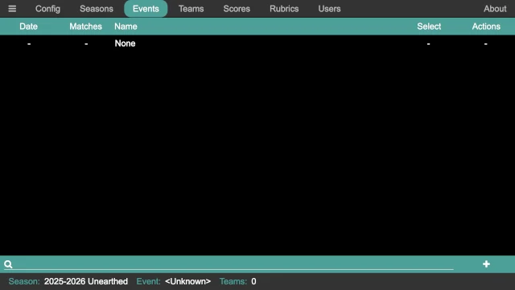
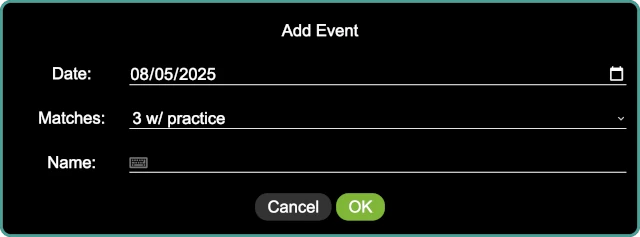
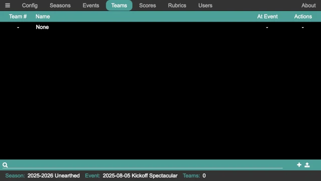
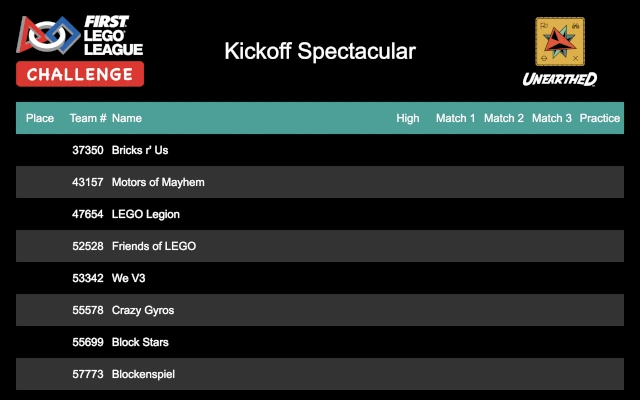
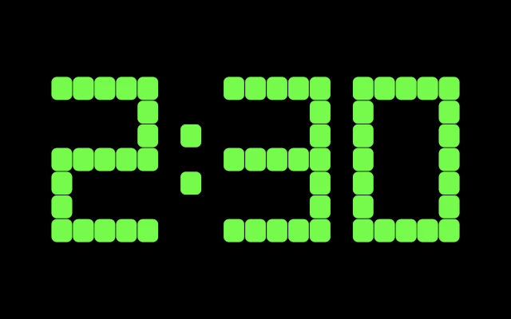

..
   Copyright (c) 2025 Brian Kircher

   Open Source Software; you can modify and/or share it under the terms of BSD
   license file in the root directory of this project.

Common Setup
============

There is some event-specific common setup that must be performed, no matter how
the event is run.  Those steps are described here, and are a prerequisite to
the following quickstart guides.

If an event has already been run using the scoring computer, it is possible
that the first two steps can be skipped, and the :ref:`create_the_event` step
is the first that is needed.

Configuration
-------------

The first thing to do is some basic configuration of the scoring software to
match the region or event's needs.  Start from the QR code page:

.. image:: ../qr_codes/qr_codes.webp
   :alt: The QR code page, providing links to all the event tools
   :align: center

Click on the :doc:`../admin/admin` QR code to access the admin page, bringing
up the login screen:

Log in as the admin user; the user name is ``admin`` and the default password
is ``FLLRocks!`` (use the actual password if it has been changed!).  Once
logged in, click on the :doc:`../admin/config/config` button at the top:

There are two configuration values that require attention:

Divisions
   If the region uses a division model, division support can be enabled via
   this checkbox.  Further configuration of the division is then exposed,
   allowing the number of divisions, the division names, and the division
   colors (in order to easily distinguish them on the scoreboard) to be
   configured.  If the defaults are not suitable, they can be changed;
   otherwise, no further configuration is needed.

Scoreboard
   To support having a single audience display, the timer can optionally be
   displayed on the scoreboard.  By default, it is disabled, but it can be
   enabled via this checkbox.  When enabled, the timer can be placed at the top
   of the scoreboard (over the event name), making it easy to still see the
   scoreboard; alternatively, it can be placed in the middle of the screen
   (overlapping part of the scoreboard), making it easier to see the timer but
   partially obscuring the scoreboard (only during a match though).

The other configuration options can be adjusted if desired, though it is not
necessary.

Select a Season
---------------

The next thing to do is to select the season (in the majority of cases, the
correct season is already selected, since the latest season is the default).
In the admin panel, click on the :doc:`../admin/seasons/seasons` button at the
top:

Simply click on the desired season; it is highlighted, and it appears in the
status line at the bottom of the page.  The status line is always helpful to
ensure that the correct season, event, and number of teams are correct (in case
one of them is inadvertently changed).

Some seasons have alternate games/scoresheets.  In this case, the name below
the season logo is a dropdown selection; select an alternate game if desired
(the rules for the alternate games must be separately acquired!).

.. _create_the_event:

Create the event
----------------

The next thing to do is to create the event.  In the admin panel, click on the
:doc:`../admin/events/events` button at the top:

Click on the add event :fa:`plus` button in the lower right corner of the
page to add an event:

Enter the details for the event; the name of the event (for example, ``Kickoff
Spectacular``), the date of the event, and the number of matches in the event
(in most cases, it is ``3 w/ practice``, which is a practice match and then
three official matches).  Click on ``OK`` when done to create the event.  Then
click on the box in the ``Select`` column for the newly created event to make
it the current event.

The status line at the bottom of the admin panel always shows the currently
active event, and can always be consulted to ensure that the active event has
not been inadvertently changed (which would cause confusion for everyone
involved!).

Add the Teams
-------------

The next step is to add the teams.  Depending on previous uses of the computer,
some or all of the teams at the event may already be entered (for example, at
a championship event where all the teams have previously competed at a
qualifier event).  Or, they may all need to be entered.  Start by clicking on
the :doc:`../admin/teams/teams` button at the top of the admin panel:

Teams can be entered in one of two way:

#. Teams can be individually entered by clicking on the add team :fa:`plus`
   button in the lower right, bring up the add team dialog:

   .. image:: ../admin/teams/add_team.webp
      :alt: The add team panel, allowing a new team to be added
      :align: center

   Enter the team number, team name, and their division (if divisions are
   enabled; the division select does not appear when divisions are disabled).
   Click on ``OK`` when done to add them.  After returning to the list of
   teams, the square under the ``At Event`` column must be checked to add them
   to the currently selected event.

#. Teams can be bulk added via a CSV file by clicking on the upload
   :fa:`upload` button in the lower right.  The CSV file must contain at least
   a team number column (labeled ``number``) and a team name column (labeled
   ``name``); and must also have a division column (labeled ``division``) if
   divisions are enabled.  As an example::

      number,name
      37350,"Bricks r' Us"
      43157,"Motors of Mayhem"
      47654,"LEGO Legion"
      52528,"Friends of LEGO"
      53342,"We V3"
      55578,"Crazy Gyros"
      55699,"Block Stars"
      57773,"Blockenspiel"
      57873,"Beams & Axles"
      58405,"Snapped Together"
      63979,"Spike Storms"
      64057,"Gearheads"

   This adds twelve teams to the event.  The columns in the CSV can be in any
   order, and additional columns are ignored.  The names of the columns must
   match these labels, but can be capitalized in any manner.

   When adding teams via a CSV file, they are all added to the current event
   automatically.  If the team already exists, it is simply added to the
   current event, so it is safe to re-upload the CSV file (for example if there
   are any late additions to the event, and a master CSV is updated).

Showing the Scoreboard
----------------------

In order to show the scoreboard, start from the QR code page:

.. image:: ../qr_codes/qr_codes.webp
   :alt: The QR code page, providing links to all the event tools
   :align: center

Click on the :doc:`../scoreboard/scoreboard` QR code to bring up the
scoreboard.  Alternatively, as would happen if a different computer is being
used to display the scoreboard, the URL under the QR code can be typed into the
browser on the other computer.

.. note::
   If using a different computer, additional steps may be needed to ensure that
   there is a network connection between the two computers so that they can
   communicate; see :doc:`networking` for details.

This page displays the current scoreboard.  Eight teams are displayed at a
time, periodically updating to the next eight teams and wrapping back to the
start after the final teams are displayed.  New scores do not appear on the
scoreboard until it starts the cycle back over at the first team, which may add
to the suspense of teams waiting to see their score!  If divisions are enabled,
the scoreboard cycles through the score for the divisions in order (in other
words, the first division, then the second division, and so on).

This is a display-only page, so it is safe to have out where participants may
be able to access it (though hopefully they demonstrate good Gracious
Professionalism and leave it alone!).  It is also worth noting that no game
sounds are produced by the scoreboard page (even when the timer is enabled);
they are only played on the computer that runs the main application.

Once the scoreboard is displayed and moved to the appropriate screen (for
example, if a secondary output from the comptuer is being used to display the
scoreboard), pressing *Ctrl-F* when the scoreboard window is selected makes the
scoreboard be fullscreen.  This hides the window decorations, tool bars, and so
on, so that just the scoreboard is visible.  Pressing *Escape* or *Ctrl-F*
leaves fullscreen mode.

Showing the Timer
-----------------

If the scoreboard is configured to show the timer, it is likely that this step
can be skipped!  If, however, a separate timer is being displayed (either in
conjunction with a timer on the scoreboard, or instead of a timer on the
scoreboard), the timer needs to be displayed.

Like showing the scoreboard, start from the QR code page:

.. image:: ../qr_codes/qr_codes.webp
   :alt: The QR code page, providing links to all the event tools
   :align: center

Click on the :doc:`../timer/timer` QR code to bring up the timer.
Alternatively, especially if a different computer is being used to display the
timer, the URL under the QR code can be typed into the browser on the other
computer.

.. note::
   The same network connection requirement exists here!

This page displays the current state of the timer.  It is a display-only page,
so it is safe to have out where participants maybe able to access it (though
hopefully they demonstrate good Gracious Professionalism and leave it alone!).
It is also worth noting that no game sounds are produced by the timer page;
they are only played on the computer that runs the main application.

Once the timer is displayed and moved to the appropriate screen (for example,
if a secondary output from the comptuer is being used to display the timer),
pressing *Ctrl-F* when the timer window is selected makes the timer page be
fullscreen.  This hides the window decorations, tool bars, and so on, so that
just the match timer is visible.  Pressing *Escape* or *Ctrl-F* leaves
fullscreen mode.

Next Steps
----------

The next steps depends on how the event is being scored.  There are two main
choices:

:doc:`scorekeeper`
   An event with the referees filling out paper scoresheets and a scorekeeper
   entering them into the computer.

:doc:`referee`
   An event with the referees filling out the electronic scoresheet on a tablet
   or phone.