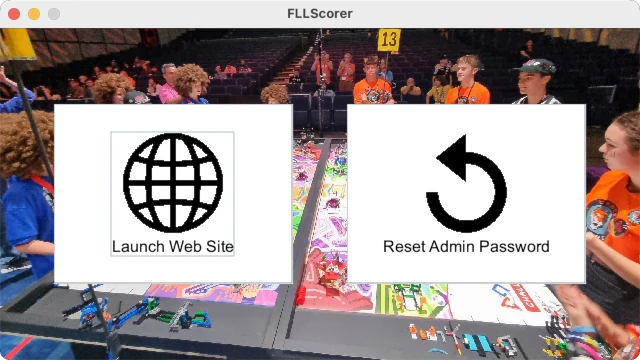

..
   Copyright (c) 2025 Brian Kircher

   Open Source Software; you can modify and/or share it under the terms of BSD
   license file in the root directory of this project.

Quickstart
==========

This quickstart covers the essentials of getting an event running using FLL
Scorer.

Requirements
------------

The minimum requirements to run an event with FLL Scorer is a computer with two
display outputs (for example, a laptop with an output for a second display) and
a large display or projector for providing the audience display (in reality, an
audience display isn't truly required, but is highly recommended).  The
computer must have a Java Runtime (version 17 or later), and of course the FLL
Scorer software!  This computer must also be connected to a sound system so
that the game sounds (match start, 30 second warning, and match end) can be
heard by the referees and teams (unless alternate means are being used to time
the matches).

More capabilities require additional equipment; another computer/display to
have a separate timer display, another computer/display to have a scoreboard in
the pits (instead of/in addition to the competition floor), another computer to
have multiple scorekeepers entering scores, and so on.  Adding additional
computers also requires some networking setup; either one that is brought into
the venue or one that already exists in the venue; these details are covered in
:doc:`networking`.

Downloading FLL Scorer
----------------------

The latest version of FLL Scorer can be downloaded from GitHub_;
``FLLScorer.jar`` is the only file that needs to be downloaded.  It can be
placed in any location that is convenient; there is no installer and no install
process.  It will create two files in whichever directory it resides in;
``scores.db`` which contains all the information captured/stored by the scoring
system, and ``log.txt`` that contains a transaction log of all changes to
``scores.db``.

Downloading a Java Runtime
--------------------------

Obtaining a Java Runtime is largely left as an exercise for the reader.  The
steps required and the places to go download the runtime varies from platform
to platform; in this case, Google_ is your friend!

Running FLL Scorer
------------------

Starting the application is as easy as double clicking on the Jar file in the
file display application of the operating system; Finder on MacOS, Explorer on
Windows, and any number of different possibility on the various Linux
distributions.  If everything is setup correctly, the following will be
displayed:

Clicking on the ``Launch Web Site`` button opens the web site, where all the
fun happens, in the default browser:

.. image:: ../qr_codes/qr_codes.webp
   :alt: The QR code page, providing links to all the event tools
   :align: center

Browser Support
---------------

FLL Scorer is developed using Chrome (which includes Chromium), but should
display correctly using other browsers.  Having Chrome as a backup is
recommended in case something strange occurs in the middle of an event with
another browser; better to get through an event with Chrome than to be broken
and stuck with something else.  Of course, if an event has been successful with
another browser, future events should also work with that browser.

For mobile devices, Safari on iOS is used during development and is known to
work very well.  Android becomes much more interesting as there are a variety
of default browsers in the different adaptations of Android.

If you encounter problems with a particular browswer (desktop or mobile),
please report it in an issue_ so that it can be fixed.  Thanks!

.. _GitHub: https://github.com/tools-for-fll/FLLScorer/releases
.. _Google: https://www.google.com
.. _issue: https://github.com/tools-for-fll/FLLScorer/issues