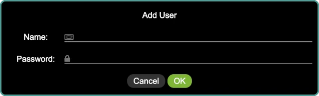
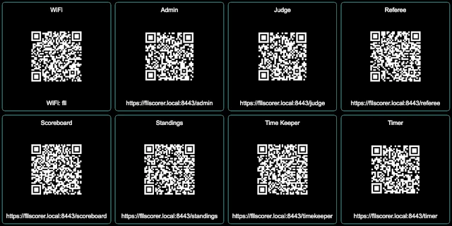
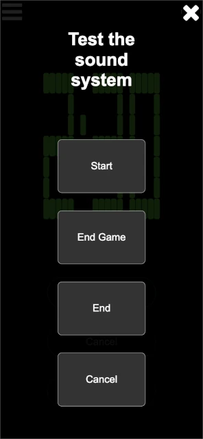

..
   Copyright (c) 2025 Brian Kircher

   Open Source Software; you can modify and/or share it under the terms of BSD
   license file in the root directory of this project.

Events with Referees Scoring
============================

By having referees enter scores directly into the scoring system, the need for
paper scoresheets is eliminated.  This is both good for the environment and
eliminates the possibility of running out of paper scoresheets!

FLL Scorer supports running an event with the referees directly entering the
scoresheets.  This is a more complicated setup, however, as there must be
devices for the referees to use (it could be a device supplied by the event,
or the referees could use their personal cell phones), and there must be a
network setup that allows the scoring devices to access the computer that runs
FLL Scorer.

This guide provides the quick step-by-step process of setting up an event to
run this way.

.. attention::
   Remember that this depends on the :doc:`common`.

   Since this requires the use of multiple computers/devices, additional steps
   are needed to ensure that there is a network connection between those
   devices so that they can communicate; see :doc:`networking` for details.

Adding Users
------------

Having different users is more important for this type of event.  To add a
user, click on the :doc:`../admin/users/users` button at the top of the admin
panel:

.. image:: users.webp
   :alt: The users panel, showing all the users
   :align: center

Then, click on the add user :fa:`plus` button in the lower right to add a user:

Provide the name for the user and the user's password.  Click on ``OK`` to add
the user, initially with no permissions.

.. note::
   If a user forgets their password, the edit :fa:`pencil` button on the right
   side of the user's line in the list can be used to edit the user and change
   their password.

Once the user is added, the required permissions must be provided.  For this
style of event, the easiest setup is to add :ref:`role_based_logins`.  Add a
user named ``referee`` (using ``referee`` as the password, and giving them the
``referee`` permission) and a user named ``timekeeper`` (using ``timekeeper``
as the password, and giving them the ``timekeeper`` permission).  All of the
referees then login with the ``referee`` user, and the timekeeper logs in with
the ``timekeeper`` user.

.. note::
   The above passwords are suggestions only; any password can be used, just be
   sure it is not too difficult for the volunteers to enter!

Running the Timer
-----------------

The timekeeper runs the match timer; there may be a dedicated timekeeper, the
announcer may be the timekeeper, and so on.  Go to the QR code page:

On the device that is used to start the timer, scan the QR code or enter the
URL under the ``Time Keeper`` button to bring up the timer control page (if
computer that runs the FLL Scorer software is used by the timekeeper, simply
clicking on the QR code opens the timer control page locally).

After logging in as the time keeper, the timer control page is displayed:

In this case, the timer control page is shown on a mobile phone.  There is only
one button enabled at a time, based on the allowable action at any given time.
Those actions are:

Start
   This button starts the match timer.  Time starts counting down from the
   match time (2:30 for the official game, though it may be different for
   alternate games) as soon as this button is pressed, and the start sound is
   played.  All other sounds (30 second warning and end of match) are
   automatically played at the appropriate times.

Cancel
   During a match, this button cancels the match and stop the timer.  This is
   only used in very extraordinary situations, and hopefully is never used at
   an event!  The timer immediately stops (turning red), and the match canceled
   sound is played.

Reset
   When a match is over (either because the timer expired or the match was
   canceled), this button resets the timer, preparing it for the next match.
   The timer automatically resets 15 seconds after the match ends, so this is
   only necessary if the timer needs to be reset quicker.

The majority of the time, the timekeeper only uses the ``Start`` button at the
start of a match (clicking it when the announcer says "Go" at the end of "3, 2,
1, Go!", or whatever appropriate point based on how matches are started at the
event).

Testing the Sound System
------------------------

Clicking on the settings :fa:`gear` button in the upper left of the timer
control page opens the sound system test page:

The four buttons (``Start``, ``End Game``, ``End``, and ``Cancel``) play the
corresponding sounds.  This is helpful to determine that the sound output is
making into the venue's sound system, and that it is loud enough to be heard by
the participants (both volunteers and teams).

Once done, click on the close :fa:`times` button in the upper right to close
the sound system test page.

Entering Scores
---------------

The table referees enter the scoresheets, going over them with the teams, at
the end of each match.  Go to the QR code page:

On each of the referee devices, scan the QR code or enter the URL under the
``Referee`` button to bring up the referee page.

After logging in as the referee, the referee page is displayed:

.. image:: ../referee/list.webp
   :alt: The referee page, showing the teams at the event
   :align: center

The teams are listed in numberical order, making them easier to find the team.
Next to or below each team (depending on the size of the referee's device, and
the screen orientation), there are a set of buttons, one per match that the
team is scheduled to run.

The buttons are yellow if there is not a scoresheet or score for the team, red
if there is a scoresheet but not a score, and green if there is a scoresheet
and a score.  If all is going well, the buttons should be yellow or green, and
a yellow button should be pressed when a new team comes to the table.

The head referee can also view this page to keep track of the scoring, ensuring
that that portion of the event is running smoothly.

Once the team for the current match is found, press the match button that
corresponds with the current round:

.. image:: ../referee/scoresheet.webp
   :alt: The scoresheet for a team's current round
   :align: center

After making the selections for the missions, click on the Score / S button in
the bottom right (the Score button is not enabled until a selection is made for
each mission).  It either changes from :fa:`refresh` to the match score, or if
there are errors in the selections, a popup indicates that there are errors and
error text appears below the mission(s) that are invalid.  In this case, the
match can be re-scored after the errors are corrected.

There are three buttons on the bottom left of the score page:

Discard / :fa:`times`
   This closes the scoresheet, discarding changes (if any).  If there are
   changes, a confirmation dialog ensures that the changes should be discarded.
   If there are no changes, the scoresheet is closed immediately.

Save / :fa:`save`
   This saves and then closes the scoresheet; the score is not published to the
   scoreboard.  This is useful if the team and the scoresheet are being passed
   off to the head referee for discussions, allowing the event to continue.
   The scoresheet can be saved even if it is not fully filled out.

Publish / :fa:`paper-plane-o`
   This saves the scoresheet, publishes the score to the scoreboard, and closes
   the scoresheet.  This button is only enabled when the scoresheet has a valid
   score (obtained via the Score button).

Once fully entered, the scoresheet should be scored and then published.  Repeat
for every team at your table throughout the event.  Get a friend to help with
resetting the table between matches and be sure to eat snacks and drink lots of
water!

Exporting the Final Scores
--------------------------

At the end of the robot game matches (and possibly before the end, typically
during the third round), the judges need a copy of the robot game scores and
ranks.  On the scoring computer, click on the :doc:`../admin/scores/scores`
button:

The download :fa:`download` button in the bottom right corner of the page
generates a CSV file with all the teams, their ranks, score, and robot game
Core Values scores, and downloads that to the computer.  This provides all the
information that the judges need; provide this CSV file to them (thumb drive,
carrier pigeon, and so on...the details are left as an exercise for the
reader!).