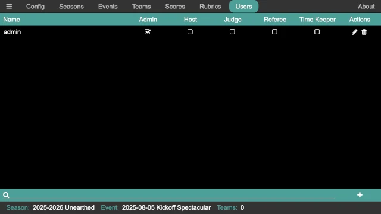
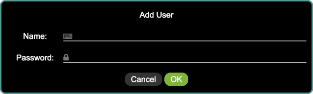
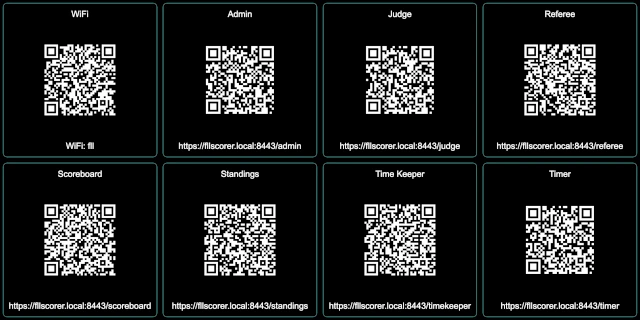
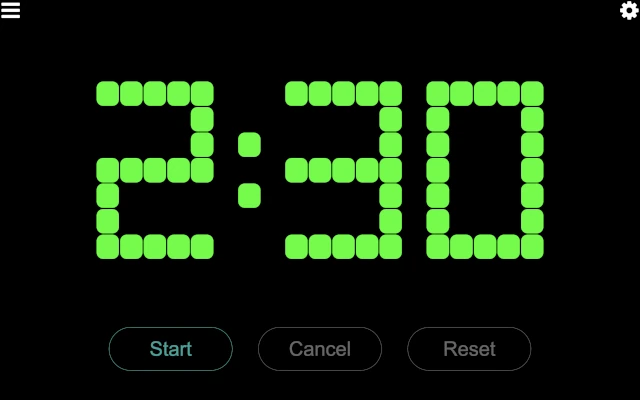
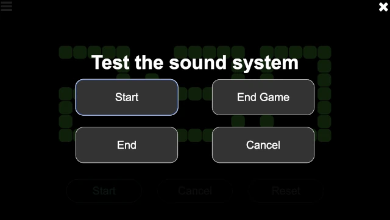
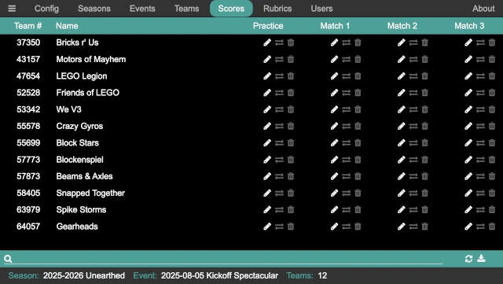
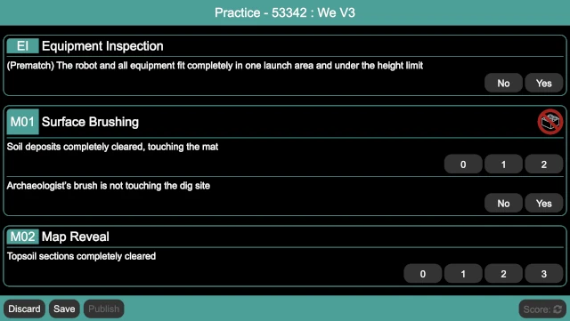

..
   Copyright (c) 2025 Brian Kircher

   Open Source Software; you can modify and/or share it under the terms of BSD
   license file in the root directory of this project.

Events with a Scorekeeper
=========================

Prior to the days of electronic scoring at the table, paper scoresheets were
used to capture the state of each match, and a designated scorekeeper (or
multiple scorekeepers at larger events) were used to calculate a score from the
paper scoresheet and enter it into the scoreboard.  Even with the advent of
electronic scoring, some regions still use this model, and it has some great
benefits (most notably the scoresheets can be given to the teams at the end of
the event, along with their judging rubrics, as a record of the event).

FLL Scorer supports running an event in this manner; the designated
scorekeeper(s) use a device (the computer that is running FLL Scorer, another
computer, a tablet, and so on) to transcribe the scoresheets into the page
intended for referees.

This guide provides the quick step-by-step process of setting up an event to
run this way.

.. attention::
   Remember that this depends on the :doc:`common`.

Adding Users
------------

It is not strictly necessary to add users, as the scorekeeper can simply use
the admin user to perform all of their responsibilitites.  However, a user can
be added if desired (to reduce the permissions of the scorekeeper).  To add a
user, click on the :doc:`../admin/users/users` button at the top of the admin
panel:

Then, click on the add user :fa:`plus` button in the lower right to add a user:

Provide the name for the user and the user's password.  Click on ``OK`` to add
the user, initially with no permissions.

.. note::
   If a user forgets their password, the edit :fa:`pencil` button on the right
   side of the user's line in the list can be used to edit the user and change
   their password.

Once the user is added, the required permissions must be provided.  For this
style of event, the Host permission allows the scorekeeper the ability to
perform all the required actions (add/edit scores, and run the timer).

.. important::
   The admin user must log out (the :fa:`bars` button in the upper left, then
   the logout button) and the new user must log in in order to complete the
   reduction of permissions!

Running the Timer
-----------------

The scorekeeper usually also runs the match timer.  Go to the QR page and click
on the :doc:`../timekeeper/timekeeper` button.

This brings up the timer control page:

There is only one button enabled at a time, based on the allowable action at
any given time.  Those actions are:

Start
   This button starts the match timer.  Time starts counting down from the
   match time (2:30 for the official game, though it may be different for
   alternate games) as soon as this button is pressed, and the start sound is
   played.  All other sounds (30 second warning and end of match) are
   automatically played at the appropriate times.

Cancel
   During a match, this button cancels the match and stop the timer.  This is
   only used in very extraordinary situations, and hopefully is never used at
   an event!  The timer immediately stops (turning red), and the match canceled
   sound is played.

Reset
   When a match is over (either because the timer expired or the match was
   canceled), this button resets the timer, preparing it for the next match.
   The timer automatically resets 15 seconds after the match ends, so this is
   only necessary if the timer needs to be reset quicker.

The majority of the time, the scorekeeper only uses the ``Start`` button at the
start of a match (clicking it when the announcer says "Go" at the end of "3, 2,
1, Go!", or whatever appropriate point based on how matches are started at the
event).

Typically, the scorekeeper keeps the timer control page in a different tab or
a different browser window.  When needing to start a match, they can quickly
change to the timer control tab/window, start the match, and then change back
to the tab/window where they are entering scores.

Testing the Sound System
------------------------

Clicking on the settings :fa:`gear` button in the upper left of the timer
control page opens the sound system test page:

The four buttons (``Start``, ``End Game``, ``End``, and ``Cancel``) play the
corresponding sounds.  This is helpful to determine that the sound output is
making into the venue's sound system, and that it is loud enough to be heard by
the participants (both volunteers and teams).

Once done, click on the close :fa:`times` button in the upper right to close
the sound system test page.

Entering Scores
---------------

To enter scores, click on the :doc:`../admin/scores/scores` button at the top
of the admin panel:

The teams are listed in team number order, making it easier to find the team.
Alternatively, the search at the bottom of the page can be used to quickly find
a team (by either their team number or their team name).

Next to each team, there are three buttons under each robot game round:

Edit / :fa:`pencil`
   This allows the scoresheet for this round to be entered or edited.  It opens
   a new window or tab (depending on the configuration of the browser) to view
   and/or edit the scoresheet.

Exchange / :fa:`exchange`
   On occasion, a scoresheet is entered for the wrong team or round.  Instead
   of re-entering the scoresheet for the correct team/round, this allows the
   scoresheet (and score) to be swapped with another scoresheet.  It performs
   an exchange; so it is safe to use if two team's scoresheets were entered for
   each other.

Delete / :fa:`trash`
   This deletes the scoresheet (and score) for a team and round.  A
   confirmation dialog ensures that the scoresheet should be deleted, and if
   confirmed the scoresheet is permanently deleted.

   .. danger::
      There is no undo!

Once a team is found, click on the edit :fa:`pencil` button under the correct
match column to enter the team's scoresheet for that match.  It opens a new
window/tab with the referee page for entering a scoresheet:

After making the selections for the missions, click on the Score button in the
bottom right (the Score button is not enabled until a selection is made for
each mission).  It either changes from :fa:`refresh` to the match score,
or if there are errors in the selections, a popup indicates that there are
errors and error text appears below the mission(s) that are invalid.  In this
case, the match can be re-scored after the errors are corrected.

There are three buttons on the bottom left of the scoresheet page:

Discard
   This closes the scoresheet, discarding changes (if any).  If there are
   changes, a confirmation dialog ensures that the changes should be discarded.
   If there are no changes, the scoresheet is closed immediately.

Save
   This saves and then closes the scoresheet; the score is not published to the
   scoreboard.  This is useful if there are questions about the scoresheet, for
   either the head referee or the table referee.  The scoresheet can be saved
   even if it is not fully filled out.

Publish
   This saves the scoresheet, publishes the score to the scoreboard, and closes
   the scoresheet.  This button is only enabled when the scoresheet has a valid
   score (obtained via the Score button).

.. note::
   If a scoresheet is reviewed and changed (for example, if a team questions
   their score and a mistake is found), the updated scoresheet must be
   published again for the score to update on the scoreboard.

Once fully entered, the scoresheet should be scored and then published.  Then,
repeat for every scoresheet throughout the event.  Get a friend to help with
entering scoresheets and be sure to eat snacks and drink lots of water!

At the end of the robot game matches (and possibly before the end, typically
during the third round), the judges need a copy of the robot game scores and
ranks.  The download :fa:`download` button in the bottom right corner of the
page generates a CSV file with all the teams, their ranks, score, and robot
game Core Values scores, and downloads that to the computer.  This provides all
the information that the judges need; provide this CSV file to them (thumb
drive, carrier pigeon, and so on...the details are left as an exercise for the
reader!).