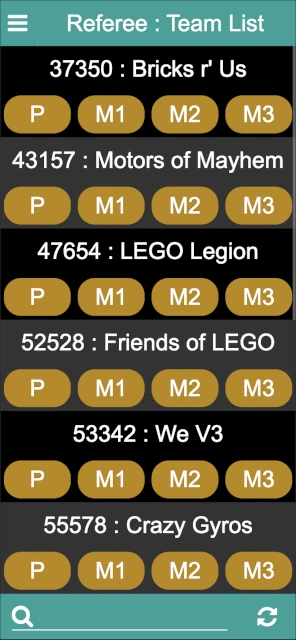

..
   Copyright (c) 2025 Brian Kircher

   Open Source Software; you can modify and/or share it under the terms of BSD
   license file in the root directory of this project.

Referee
=======

The referee page provides a means for the table referees to enter scoresheets
at the conclusion of matches, while at the same time providing a way for the
head referee to monitor the state of the scoresheet entry.  At first, it
displays a list of the teams and matches to be scored at the event (shown here
on a phone screen):

The matches are color-coded:

Yellow
   This represents a match that has not been scored.  At the start of the
   event, all the matches are yellow (as in the above image).

Red
   This represents a match that has been scored but the score has not been
   published.  For example, this may happen if the table referee completes
   most of the scoring but passes the team (and scoresheet) to the head referee
   to handle resolving a scoring/ruling discussion.

Green
   This represents a match that has been scored and the score published.  At
   the end of the event, all matches should be green (unless there are
   no-shows, either to the entire event or to a match here or there).

The list of teams can be scrolled through to find the team to be scored (they
are listed in team number order), or the search at the bottom of the screen can
be used to search (by either team name or team number).

The :fa:`refresh` button in the bottom right refreshes the list of matches; in
normal conditions, this is not necessary (as scoresheet entries made by other
referees are automatically reflected onto all the referee's displays); this can
be used in case something doesn't seem right, or to confirm that the latest and
greatest is being displayed.

Clicking on a team's match brings up the scoresheet for that match:

.. image:: scoresheet.webp
   :alt: Scoresheet Entry
   :align: center

The scoresheets matches (if possible, otherwise closely approximates) the
official scoresheet.  A choice must be made for every mission condition before
the match can be scored; the Core Values score (if present) is not a
requirement for scoring (allowing the match to be score and shown to the team
prior to entering the Core Values score).

After making the selections for the missions, click on the Score / S button in
the bottom right (the Score button is not enabled until a selection is made for
each mission).  It either changes from :fa:`refresh` to the match score, or if
there are errors in the selections, a popup indicates that there are errors and
error text appears below the mission(s) that are invalid.  In this case, the
match can be re-scored after the errors are corrected.

There are three buttons on the bottom left of the score page:

Discard / :fa:`times`
   This closes the scoresheet, discarding changes (if any).  If there are
   changes, a confirmation dialog ensures that the changes should be discarded.
   If there are no changes, the scoresheet is closed immediately.

Save / :fa:`save`
   This saves and then closes the scoresheet; the score is not published to the
   scoreboard.  This is useful if the team and the scoresheet are being passed
   off to the head referee for discussions, allowing the event to continue.
   The scoresheet can be saved even if it is not fully filled out.

Publish / :fa:`paper-plane-o`
   This saves the scoresheet, publishes the score to the scoreboard, and closes
   the scoresheet.  This button is only enabled when the scoresheet has a valid
   score (obtained via the Score button).

Once fully entered, the scoresheet should be scored and then published.  Repeat
for every team at your table throughout the event.