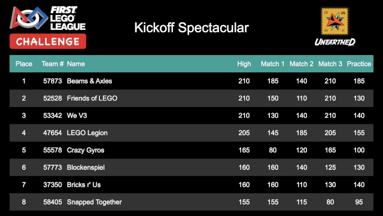

..
   Copyright (c) 2025 Brian Kircher

   Open Source Software; you can modify and/or share it under the terms of BSD
   license file in the root directory of this project.

Scoreboard
==========

The scoreboard is an audience display showing the results and standings of the
robot game at an event.  It cycles through all of the teams at the event, in
placement order; if division support is enabled, it cycles through all the
teams in the first division, then the second division, and so on.  Once it has
reached the end of the divisions/teams, it starts over from the beginning.

When the scoreboard is the active window, pressing *Ctrl-F* puts it into
fullscreen mode, hiding all the window decorations, browser address bar,
browser tool bar, etc.  This makes for a much cleaner audience display.
Pressing *Ctrl-F* again, or *Escape*, leaves fullscreen mode.

It is possible to pause the scoreboard by pressing *Ctrl-P*; a color-shifting
pause sign is shown in the header while the scoreboard is paused.  Pressing
*Ctrl-P* again will resume the normal cycling of the scoreboard.

Each time through the score cycle, the current standings are fetched from the
scoring system.  This set of standings are displayed for the entire cycle,
ensuring that a cycle through the scoreboard is consistent.  Because of this,
it may appear to take an extra long time for newly entered scores to appear;
this is merely an artifact of displaying a consistent set of standings
(updating on the fly could result in a team appearing twice in the standings,
or a team not appearing at all in the standings, at least for one cycle
through the standings).