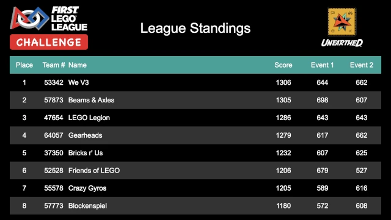

..
   Copyright (c) 2025 Brian Kircher

   Open Source Software; you can modify and/or share it under the terms of BSD
   license file in the root directory of this project.

Standings
=========

The standings page is an audience display showing the current league standings.
It cycles through all of the teams in the league, in placement order; if
division support is enabled, it cycles through all the teams in the first
division, then the second division, and so on.  Once it has reached the end of
the divisions/teams, it starts over from the beginning.

When the standings page is the active window, pressing *Ctrl-F* puts it into
fullscreen mode, hiding all the window decorations, browser address bar,
browser tool bar, etc.  This makes for a much cleaner audience display.
Pressing *Ctrl-F* again, or *Escape*, leaves fullscreen mode.

It is possible to pause the standings page by pressing *Ctrl-P*; a
color-shifting pause sign is shown in the header while the standings is paused.
Pressing *Ctrl-P* again will resume the normal cycling of the standings.

Given how rapidly the league standings may change during an individual event,
this is probably not something that should be shown during the event.  The best
time to display it would be at the end of the awards ceremony, after all awards
have been handed out (and the standings can no longer inadvertently reveal any
awards).

.. note::
   The league standings are not necessarily computed in the exact same manner
   as determining Champions Award and team advancements.  This should be taken
   into consideration when deciding whether to display the league standings (or
   use the league support at all).