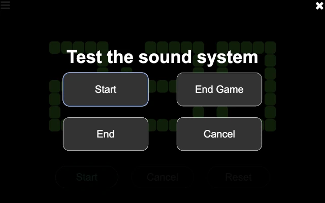

..
   Copyright (c) 2025 Brian Kircher

   Open Source Software; you can modify and/or share it under the terms of BSD
   license file in the root directory of this project.

Time Keeper
===========

The time keeper page provides controls for starting, stopping, and resetting
the match timer.

.. image:: control.webp
   :alt: Time keeper controls
   :align: center

There is only one button enabled at a time, based on the allowable action at
any given time.  Those actions are:

Start
   This button starts the match timer.  Time starts counting down from the
   match time (2:30 for the official game, though it may be different for
   alternate games) as soon as this button is pressed, and the start sound is
   played.  All other sounds (30 second warning and end of match) are
   automatically played at the appropriate times.

Cancel
   During a match, this button cancels the match and stop the timer.  This is
   only used in very extraordinary situations, and hopefully is never used at
   an event!  The timer immediately stops (turning red), and the match canceled
   sound is played.

Reset
   When a match is over (either because the timer expired or the match was
   canceled), this button resets the timer, preparing it for the next match.
   The timer automatically resets 15 seconds after the match ends, so this is
   only necessary if the timer needs to be reset quicker.

The majority of the time, the time keeper only uses the ``Start`` button at the
start of a match (clicking it when the announcer says "Go" at the end of "3, 2,
1, Go!", or whatever appropriate point based on how matches are started at the
event).

Clicking on the settings :fa:`gear` button in the upper left of the timer
control page opens the sound system test page:

The four buttons (``Start``, ``End Game``, ``End``, and ``Cancel``) play the
corresponding sounds.  This is helpful to determine that the sound output is
getting into the venue's sound system, and that it is loud enough to be heard
by the participants (both volunteers and teams).

Once done, click on the close :fa:`times` button in the upper right to close
the sound system test page.